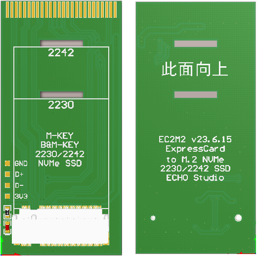

# ExpressCard_34M2

EC2M2: ExpressCard 34mm or 54mm to M.2 NVMe 2230 or 2242 SSD adapter card.

## 简介

ExpressCard详细介绍请参考[WikiPedia](https://en.wikipedia.org/wiki/ExpressCard)，这个接口提供了一条PCIe通道和一个USB2.0接口，以及3.3V电源。Sandy Bridge时代的笔记本普遍不具备USB3.0接口，所以ExpressCard接口的PCIe通道经常用来扩展USB3.0接口，由于ExpressCard接口只提供了3.3V电源，功率也不大，升压到5V以后功率进一步损失，这些ExpressCard的USB3.0扩展卡供电普遍不佳，不加外部供电的情况下，对外输出电流不超过1A，很难带动移动硬盘这样的大功率负载。

Ivy Bridge时代USB3.0接口成为笔记本标配，ExpressCard转USB3.0也逐渐失去了价值，这个接口逐渐被闲置。那个时代，硬盘的主流协议还是SATA，无论传统2.5寸还是小型化的mSATA，M.2接口那时候还叫作NGFF，协议也是SATA。随着时间的推移，NVMe逐渐成为主流，当前硬盘的主流已经是M.2接口2280外形NVMe协议，也有很多2230和2242外形的短硬盘，这些短硬盘可以完美放入34mm和54mm的ExpressCard卡，布局如下：

## 主要特征

- 支持2230和2242外形NVMe协议短硬盘
- 支持34mm和54mm两种ExpressCard外壳
- PCIe协议直连，无性能损失，不发热（SSD自身还是会发热的）
- 大板设计，强度高散热好
- 创新的M.2固定方式，不使用螺丝，降低总高度
- 带SSD工作指示灯，工作电流不足1mA，省电不刺眼
- 通过焊盘引出ExpressCard的USB 2.0接口

## 安装方法

安装步骤如下：

1. 揭开EC2M2卡2230或者2242位置的固定胶带，将SSD水平插入，然后使用胶带固定SSD尾部
2. 将EC2M2卡放入金属底壳，注意SSD那一面朝下放置
3. 盖上EC2M2卡金属上盖，保证两侧卡口完全咬合
4. 将安装完成的EC2M2卡推入笔记本的ExpressCard插槽，34mm版本注意不要插反

Win10系统无需驱动，Win7需要安装[KB2990941](driver/Win7_NVMe_Driver/x64/Windows6.1-KB2990941-v3-x64.msu)和[KB3087873](driver/Win7_NVMe_Driver/x64/Windows6.1-KB3087873-v2-x64.msu)两个补丁才能识别NVMe硬盘。由于驱动限制，Win7下无法查看硬盘的SMART信息，Win10下一切正常，推荐使用Win10。

安装好以后可以在CrystalDiskInfo中查看硬盘信息，SN520硬盘支持`PCIe 3.0x4`，但是X230的ExpressCard接口只支持`PCIe 2.0x1`，低速带来了更低的温度，同时对4K读写性能影响并不大。

## 性能测试

ExpressCard到NVMe协议SSD之间不存在协议转换，无性能损失。连续读写性能受PCIe协议版本本身限制，对用户体验影响更大的4K性能影响不大。以下为SN520在X230上使用EC2M2转接卡速度测试。

## 具备ExpressCard接口的笔记本

Intel三代CPU及之前的ThinkPad很多具备ExpressCard接口，大部分都是PCIe2.0x1协议，速度接近SATA3，可用性良好。Ivy Bridge后续机型大多数取消了ExpressCard接口，只有ThinkPad的P系列等少数机型保留了34mm的ExpressCard接口，得益于SkyLake架构升级，ExpressCard接口的PCIe协议也升级到了3.0x1，速度1GB/s，已经将SATA3远远甩在身后。

以下是具备ExpressCard接口的ThinkPad型号，欢迎补充。

- X200/X201，54mm
- X220(i)/X230(i)，54mm，PCIe 2.0x1
- T60(p)/T400，54mm，PCIe 1.0x1
- T420/T430(s)，34mm，PCIe 2.0x1
- W520/W530/W541，34mm，PCIe 2.0x1
- P50/P51/P70/P71，34mm，PCIe3.0x1

## 支持的SSD型号

理论上支持所有2230和2242外形的NVMe协议SSD，注意不支持SATA协议SSD(通常叫做NGFF)。相比2280外形的长硬盘，2230和2242外形的短硬盘型号要少的多，往往只有存储大厂以OEM形式提供，常见的型号如下，欢迎补充。

- 西数：SN520/SN530/SN740
- 东芝/铠侠：BG3/BG4/BG5/BG6
- 三星：PM971/PM971a/PM991/PM991a/PM9B1/PM9C1a
- SK海力士：BC501/BC511/BC711/BC901

这些短硬盘都是单面颗粒布局，容量分布在128GB/256GB/512GB/1TB/2TB之间，截至目前SN740有最大的2TB容量版本。

## 进阶玩法

除了PCIe，ExpressCard还提供了一个USB2.0接口，由于缺少5V供电，3.3V电压功率也不充裕，这个USB2.0接口不太适合外接使用，只能连接一些小功率的USB设备，比如罗技的优联接收器。EC2M2转接卡通过焊盘形式引出了USB接口，54mm宽度外壳也有足够的空间容纳优联接收器。

